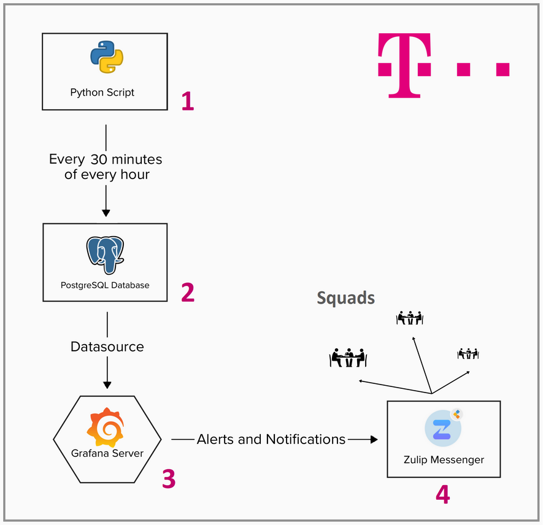
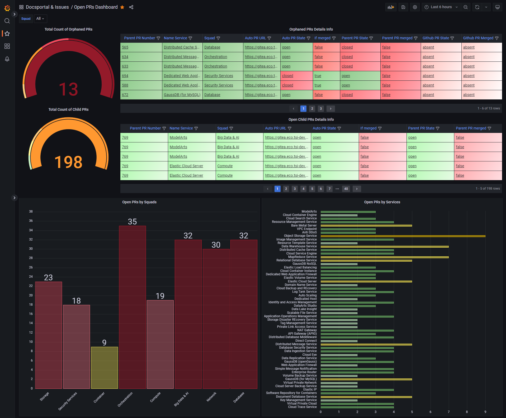
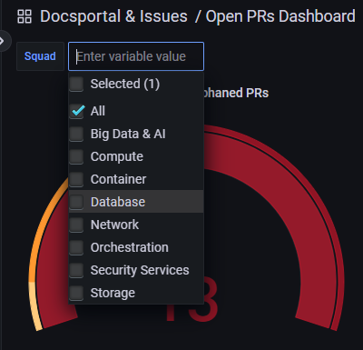
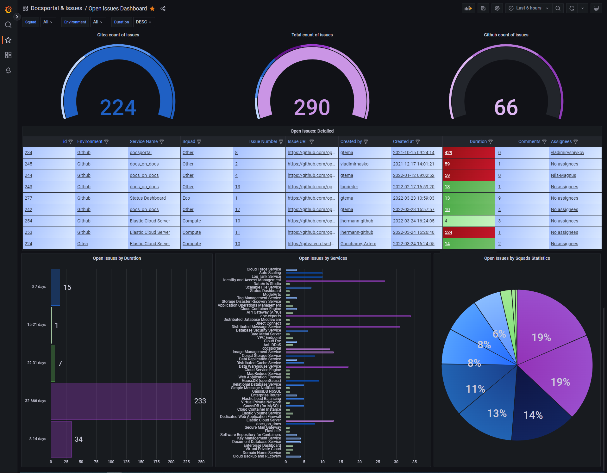
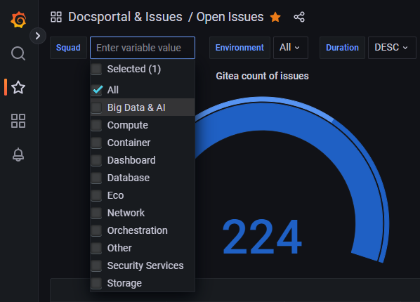
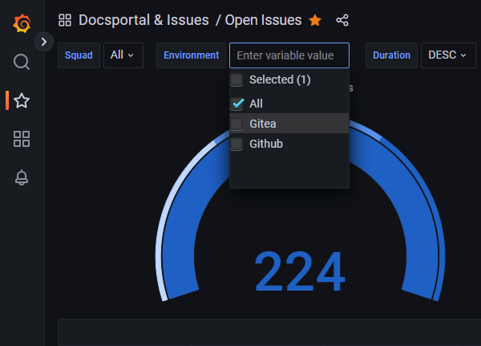
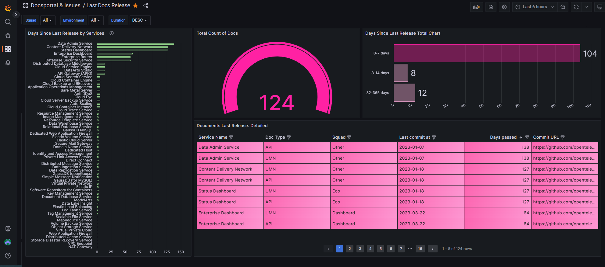

HelpCenter 3 Dashboard powered by Grafana
=========================================

The [Helpcenter](docs.otc-service.com) is the central repository for
all user and customer related documentation of the [Open Telekom
Cloud](open-telekom-cloud.com). It is based on a set of GitOps
processes, that makes writing, reviewing, releasing, and updating
documentation transparent. Core components of the Helpcenter are Git
repositories, a rendering engine that transforms restructured text
into several formats including HTML and PDF, a powerful serach engine,
and a webserver delivering the content to the users.

To maintain a continous overview of the documents, their status,
pending changes, or reported issues, a comprehensive status dashboard
has been introduce, leveraging Grafana for improved visibilityof the
associated processes. This is this dashboard's documentation.

The dashboard system consists of four components: Python scripts
extract data automatically from the repositories and other sources,
and store it in a PostgreSQL database. Grafana provides interactive
and intuitive data visualization, and Zulip alerts users with timely
notifications.

This comprehensive mechanism continously tracks and evaluates the
progress of the documentation process from the pre-production stage in
Gitea to the production stage in GitHub with seamless oversight.

.. contents::

Workflow Overview
-----------------

The entire monitoring process is comprised of the following four key
steps:

1. Execution of Python scripts extracting data from source systems.
2. Store collected data in a PostgreSQL database.
3. Visualization of data on the Grafana server.
4. Configuration of the Alert Manager and dispatch of alerts to Zulip.

All the steps provided are executed in the OTC environment.

Dashboards and Panels: What They Are and What They're For
---------------------------------------------------------

A dashboard is a tool that provides a visual display of important
information or data at a glance. It aggregates and presents key
insights derived from multiple data sources into a cohesive and easily
digestible format. Dashboards are widely used in many fields such as
business, IT, and data analytics for monitoring, reporting, and
decision-making purposes. For Helpcenter three dashboards have been
created:

* **Open PRs Dashboard:** This dashboard primarily focuses on
  monitoring open Pull Requests (PRs) in the pre-production (Gitea)
  stage, as well as orphaned PRs, which might appear during the
  rollout from Gitea to GitHub. It provides an overview of the PR's
  status, helping to identify bottlenecks and ensuring the smooth
  progression of documentation workflows.

* **Open Issues Dashboard:** This dashboard is specifically designed
  to track and manage open issues across different services and
  squads. It presents data derived from a Postgres database, offering
  insights into the distribution of issues and helping squads
  prioritize their work.

* **Last Release Dashboard:** An essential tool for tracking updates
  of specific documentats, the *Last Release Dashboard* visualizes the
  time passed since the last change for a service. Monitoring the
  update frequency aids ensuring the relevancy and timeliness of the
  documents.

Open PRs Dashboard
~~~~~~~~~~~~~~~~~~

This is a common view of the dashboard:

Located in the upper left corner of the dashboard is a drop-down list
titled *Squad.* This list serves as a dynamic filter, directly
influencing the data displayed in specific panels on the dashboard.

The **Open PRs Dashboard** consists of the following panels:

* **Total Count of Orphaned PRs:** gauge provides a visual
  representation of the total number of orphaned PRs. It can be
  dynamically filtered based on the selected Squad from the drop-down
  list, shows count of orphaned PRs for a particular Squad or for all
  Squads.

* **Orphaned PRs Detailed Info:** this panel provides detailed
  information about orphaned PRs in a tabular format. The data is
  obtained from the PostgreSQL data source. The table includes
  information such as PR State, whether the parent PR is merged, the
  parent PR number, and the Auto PR URL. This panel provides options
  to filter data by *Squads*. Each row is clickable, and leads to
  particular PR.

* **Total count of Child PRs:** this gauge provides a representation
  of the total number of Open PRs in Gitea (pre-prod stage). This
  count depends on *Squad* drop-down list, and might shows PRs for
  particular Squad - and all of them as an option.

* **Open Child PRs Detailed Info:** panel provides detailed info about
  all of the open PRs in Gitea. Data could be filtered by *Squad*
  drop-down list.

* **Open PRs by Squad:** bar chart visualizes the spreading of open
  PRs across different Squads. Each bar represents a distinct Squad;
  you can see this while hovering over of the bars. The color of the
  bars represents different range of counts, starting from
  super-light-green and ending with dark-red. Unlike other panels,
  this panel is not influenced by the *Squad* filter selection and
  always displays data regarding all Squads.

* **Open PRs by Services:** this bar chart visualizes the distribution
  of open PRs across different services.  Each bar represents a
  distinct service, which can be identified by hovering over the
  bar. The length of the bar is proportional to the number of open PRs
  associated with that service. Just like the *Open PRs by Squads
  panel,* this one also consistently displays data for all squads
  regardless of filter settings.

Open Issues Dashboard
~~~~~~~~~~~~~~~~~~~~~

In the upper left corner you can see drop-down lists: *Squad*,
*Environment* and *Duration*.

* **Squad:** represents distinct "Squads" for the *Open Issues
  Dashboard*. Supports multiple selections including an "All" option.

* **Environment:** represents distinct "Environments" for *Open Issues
  Dashboard*. Supports multiple selections and an "All" option.

* **Duration:** variable with two pre-defined options: "ASC" and
  "DESC". Allows sorting data based on duration.

The **Open Issues Dashboard** dashboard consists of four significant
panels:

* **Gitea count of issues:** this gauge panel displays the count of
  open issues in the Gitea environment. When filter *Environment* is
  set to *Github*, count here equals zero.
  
* **Total count of issues:** this panel is another gauge display that
  shows the total count of open issues across all environments and
  squads. It provides an overarching view of all open issues,
  irrespective of their source. Count of issues might be filtered with
  drpo-down list *Squad*.
  
* **Github count of issues:** like the Gitea panel, this gauge
  displays the number of open issues in the Github environment,
  offering a quick snapshot of the issue load in Github. When *Squad*
  is set to *Gitea*, equals zero.
  
* **Open Issues: Detailed:** this table panel provides more detailed
  information about the open issues. It is set to be interactive and
  filterable. It provides details such as Assignees, Issue URL, and
  also has color-coded thresholds based on the age of the issues, with
  colors ranging from green (for newer issues) to dark red (for older,
  unresolved issues).
  
* **Open Issues by Duration:** this panel presents a bar chart
  illustrating the count of open issues grouped by their duration in
  days. It helps to understand the age of unresolved issues and can be
  used to prioritize fixing of long-standing issues. The color of the
  bars represents different ranges of issue counts, from
  "super-light-green" for fewer issues to "dark-red" for a higher
  count of issues. The exact count can be seen by hovering over the
  bar. This panel doesn't depend on the *Squad* variable, and always
  shows data for all squads.
  
* **Open Issues by Services:** this panel is similar to the "Open PRs
  by Services" panel. It presents a bar chart illustrating the count
  of open issues grouped by services. Each bar represents a distinct
  service, allowing you to understand which services have the highest
  number of open issues. Just like the previous panels, the color of
  the bars represents different ranges of issue counts. This panel
  doesn't depend on the *Squad* variable, and always shows data for
  all squads.
  
* **Open Issues by Squads: Statistics:** this panel presents a pie
  chart providing a statistical representation of open issues grouped
  by Squads. Likewise panel *Open Issues by Services*, this panel
  doesn't depend on the *Squad* drop-down list and always shows data
  for all squads.

Last Docs Release Dashboard
~~~~~~~~~~~~~~~~~~~~~~~~~~~

The *Last Release Docs Dashboard* is a straightforward tool collecting
important data about *User Manual (UMN)* and *API Reference (API)*
documents. It is Helpcenter 3's objective to keep users up-to-date with
the latest document releases. That's what the Last Docs Release
Dashboard is for.

The dashboard of recently modified documents contains four panels.

* **Days Since Last Release by Services:** it displays a bar chart
  with the service names as categories and their respective maximum
  days since the last release as the metric.
  
* **Total Count of Docs:** this panel shows a gauge indicating the
  total count of documents for the chosen *Doc Type* and *Squad*.
  
* **Days Since Last Release Total Chart:** this bar chart splits docs
  into groups based on how long since they were last updated. This
  panel doesn't depend on none of variables.

* **Documents Last Release: Detailed:** this table provides detailed
  information about each document's last release. Each entry has a
  clickable link directing to the document's commit URL. Data here
  might be filtered by *Squad* or *Doc Type* drop-down list.
