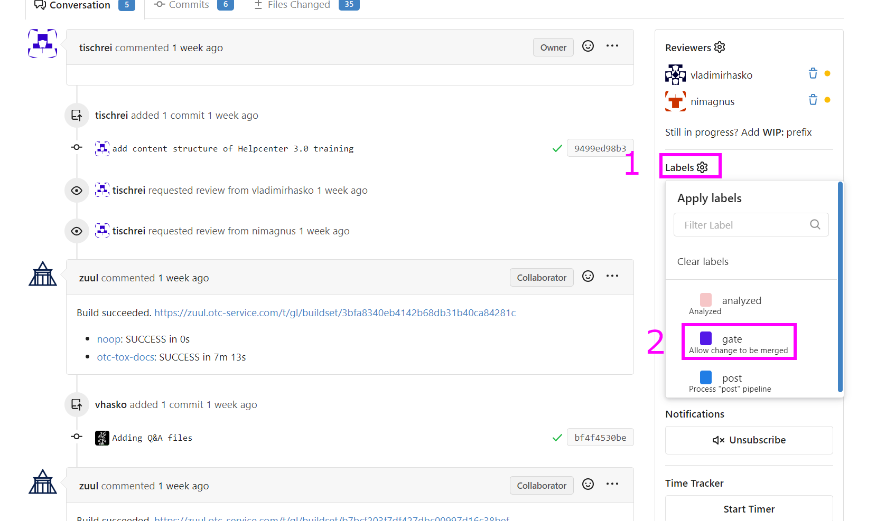

=============================================================================================
How can the docs be deployed to PRE-PROD and PROD and who will be the responsible to do that?
=============================================================================================

By triggering the label "**gate**" on gitea/github the respective automated jobs will trigger final merge and build of the documentation as well as publishing of the documentation to respective portal (PREPROD/PROD). Responsibility can be addressed to the labelling permission. Remaining stuff is in hands of zuul automation.

**Prerequesits to set the Gate label:**

1) Confirmity check of Zuul is successful (Zuul approval).
2) Approval of Pull Request by Squad member is there.

If one of these prerequesits is not there. The Zuul pipeline will not start to work and to release the document.

**How to set the Gate label:**

