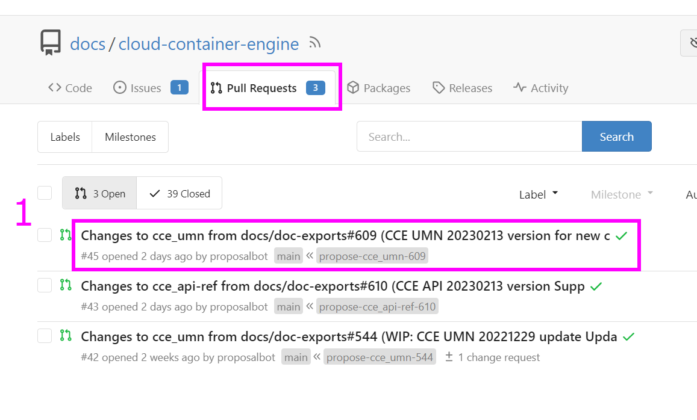
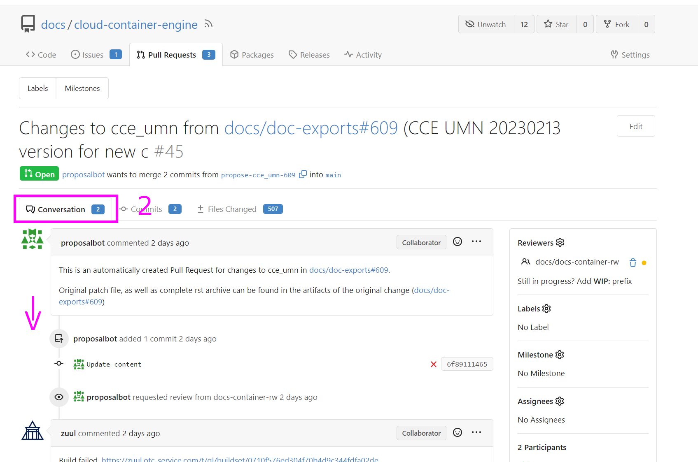
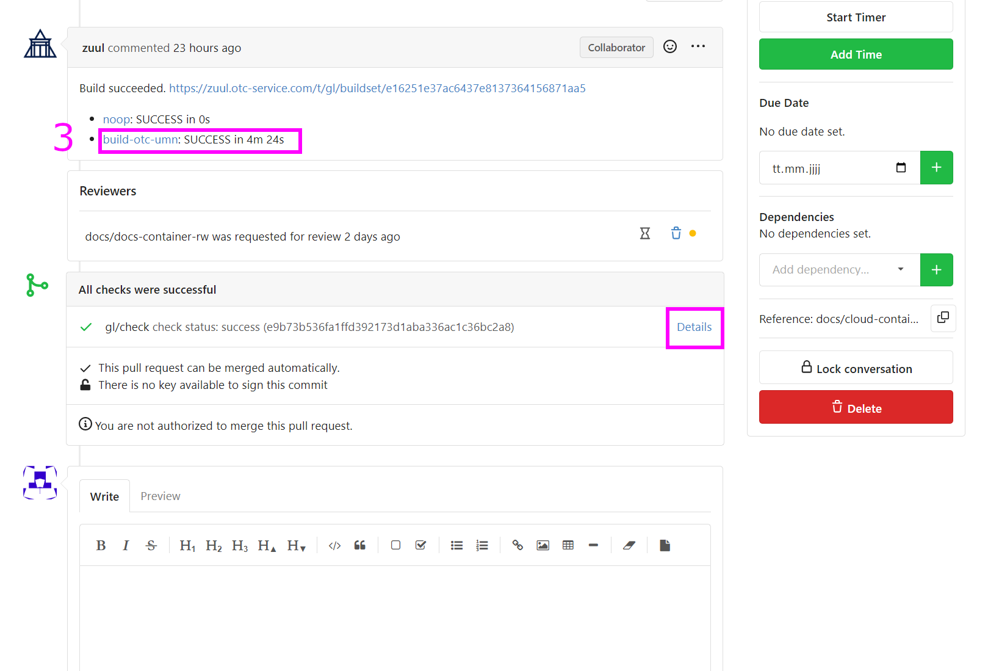
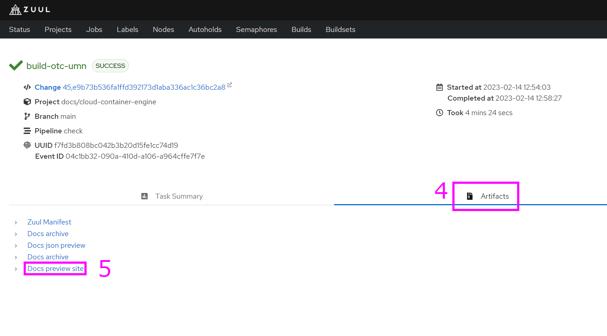
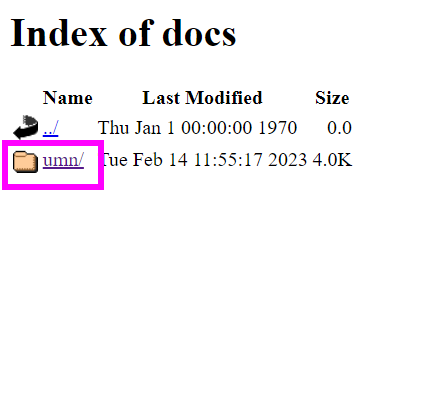
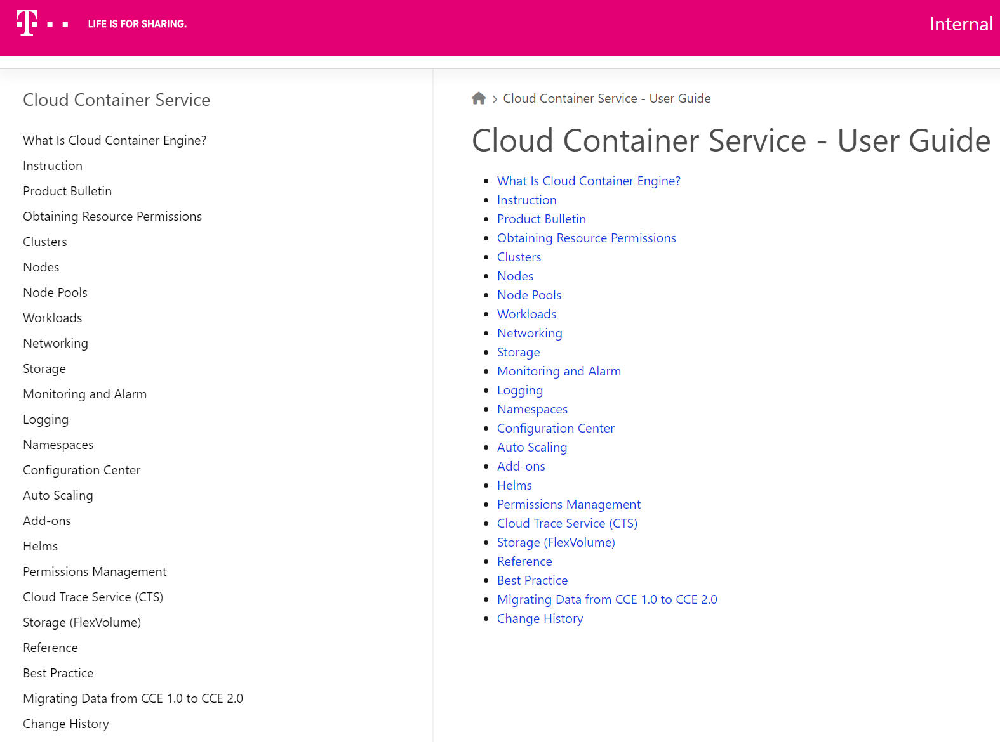

======================================================================================================
How to check the rendered HTML of the entire document in the browser (which button should I click on)?
======================================================================================================

**1) Open the PullRequest (PR) of the prefered document.**

**2) Click on the `Conversation` tab and scroll down.**

**3) Choose the link on `build-otc-<document-type>` or the `Details` link on the Zuul Check-Job.**

**4) The Zuul dashboards opens. Under the `Artifacts` tab the `Docs preview site` can be chosen.**

**5) Sometimes a file structure opens, choose the document type.**

**6) The preview site opens.**

