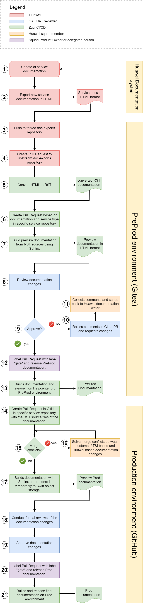

.. _documentation_change_process:

Documentation Change Process
============================

The following figure provides an overview about the current helpcenter 3.0 process.

Document Change Process Description
-----------------------------------

**Huawei Documentation System**

1) Huawei employee / Squad member receives Jira task to deliver new documentation from Huawei documentation system of specific service.
2) The documentation files are exported in HTML format and needs to be converted to RST sources which will be used by Sphinx rendering engine in a later step.

**PreProduction Environment (Gitea)**

3) Huawei employee / Squad member creates a fork from ``doc-exports`` repository. The new documentation needs to be pushed into the forked ``doc-exports`` repository. A detailed description can be found under the following link: `"How to fork a repository in Gitea and push changes." <https://gitea.eco.tsi-dev.otc-service.com/docs/doc-exports/wiki/Huawei-instructions-to-propose-changes>`_.
4) After the forked ``doc-exports`` repository has been updated, a Pull Request to the original / upstream ``doc-exports`` repository needs to be opened.
5) The automation pipeline tool Zuul CI/CD converts the delivered HTML files to reStructuredText (RST) sources with a self-written script.
6) These RST source files will be stored in single repositories located in Gitea, too. For this purpose, Zuul opens a Pull Request in the specific service repository, e.g. ``UMN`` (user manual) documentation for service ``CSS``. In the open Pull Request users are able to see differences between the old state of the documentation and the new one. Gitea provides suitable tools to comment specific lines of code, to approve a Pull Request or request changes.
7) Additionally, another pipeline in Zuul builds a preview documentation from the RST files included in the Pull Request which can be used in the review process. `Click on this reference to see how to open Pre-rendered documentation after opening an Pull Request. <https://gitea.eco.tsi-dev.otc-service.com/docs/docsportal/wiki/Review#pre_rendered_doc>`_
8) Assigned squad member(s) start the review process of the auto-created Pull Request and communicate their feedback. This can be done via the included functionality of Gitea to provide comments to a specific line of code.
9) If the Pull Request fullfils all expectations, the Pull Request will be approved by the reviewer via ``Approve`` selection and the steps 10 and 11 can be skipped. The Pull Request is marked as ``approved``.
10) The Pull Request does not fullfil all expectations and review comments needs to be added to the specific lines of code in the target repository of the specific service. After all comments are placed, the review of the Pull Request must be finished with ``Request changes`` selection instead of ``Approve``.
11) Huawei collects comments and prepare new documentation change or reply to the comments. There are two possible options to go further:

    a. Huawei member uses the comments to prepare a new documentation delivery from the beginning (out of Huawei documentation system). The whole process starts from the beginning.
    b. Changes are made directly in the Pull Request. The changes are tracked by the Huawei employee and changed in the Huawei documentation system afterwards.

12) After the review has been approved, the Squads product owner or a privileged squad member can add the ``gate`` label to the Pull Request.
13) The ``gate`` label triggers another CI/CD pipeline of Zuul to render the final PreProd documentation on https://docs-int.otc-service.com/.

**Production Environment (GitHub)**

14) Additionally, Zuul opens a Pull Request in GitHub in the specific service repository to update the Production documentation, too.
15) If there are merge conflicts, these needs to be solved (16). If no conflicts occure, skip to 17.
16) The review squad member must decide how to fix the conflict and what content is supposed to be changed. A discussion is necessary with the Product Owner if further judgement is needed.
17) If no merge conflicts are present, Zuul renders a preview documentation and store it to Swift object storage.
18) A member conduct a formal review of the documentation changes.
19) The Pull Request will be approved by the member.
20) After the review has been approved, the Squads product owner or a privileged squad member can add the ``gate`` label to the Pull Request.
21) Zuul builds and releases the final documentation on production environment: https://docs.otc.t-systems.com/
